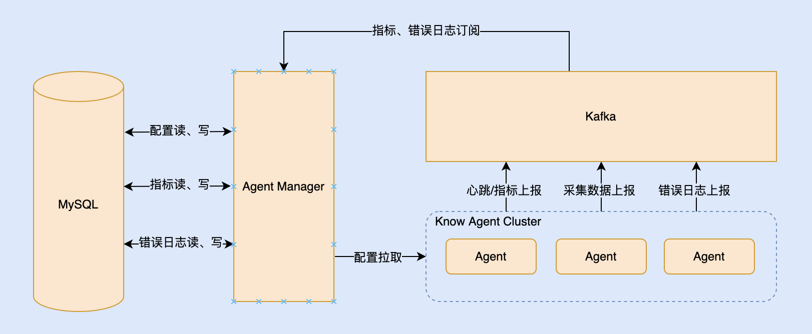
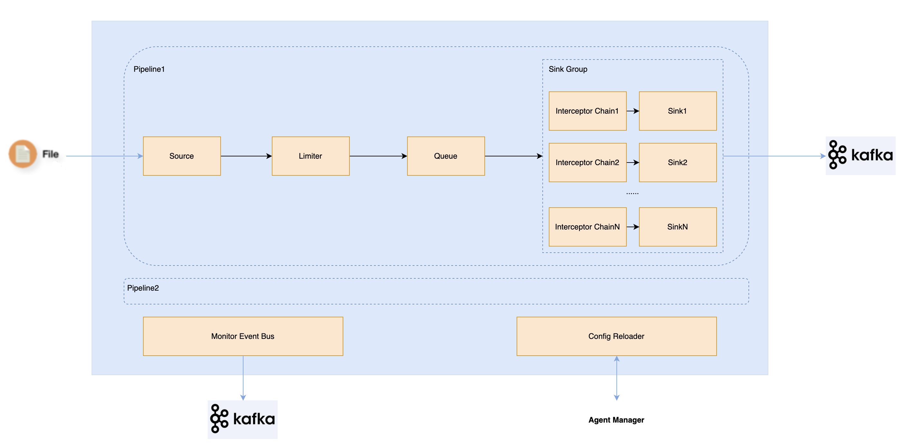
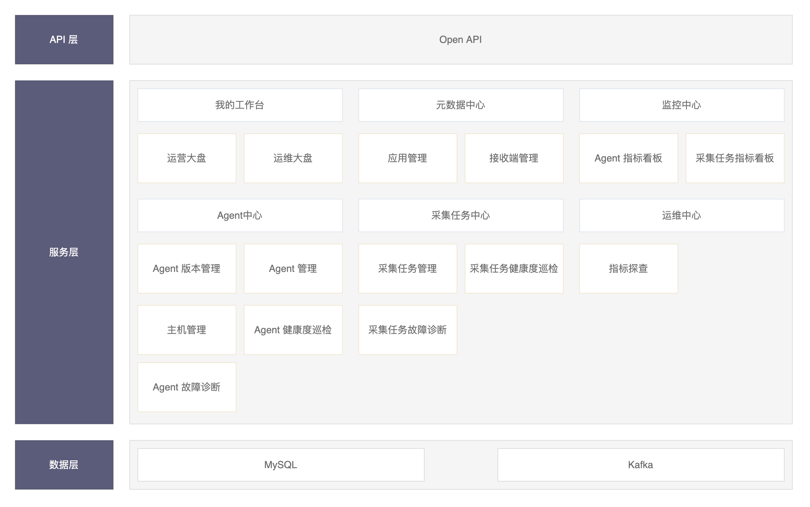

# **KnowAgent 一站式日志采集平台**

​	阅读本文档，您可以了解到 `KnowAgent` 的用户群体、产品定位等信息，并通过体验地址，快速体验以`应用`为采集粒度，从应用维度批量下发采集任务全流程。若`KnowAgent`已在贵司的生产环境进行使用，并想要获得官方更好地支持和指导，可以通过添加微信号`WilliamHu66`、`PenceXie`，加入官方交流平台。

# 1 产品简介

​	`KnowAgent` 源于滴滴多年来在各核心场景沉淀的超大规模采集引擎集群运维实践经验。经历过多方考验，对于大规模 Agent 日志采集的治理管控，采集任务与 Agent 的可观测性、健康度巡检、故障诊断已经沉淀出一套完善的解决方案。`KnowAgent` 以应用为采集粒度，满足了从业务层面创建采集任务的需求，并易于将文件采集作为流式计算的一种可靠数据源进行接入、管理。

## 1.1 前置申明

### 1.1.1 Agent 与采集任务管控规模

​	`KnowAgent` 基于最小依赖、便于体验，采用 MySQL 存储 Agent 的 Metrics 与 Error Logs 数据。受制于 MySQL 性能瓶颈，在单个采集任务对应一个采集路径、Metrics 与 Error Logs 数据保存周期为一周的情况下，支持 50 个 Agent 与 50 个采集任务的管控。如需要管控更多的 Agent 与采集任务，参见[《如何替换Agent的Metrics与Error Logs数据存储引擎以纳管更大的Agent集群》](doc/know_agent_metrics_error_logs_store_extend.md)。

### 1.1.2 容器采集

​	`KnowAgent`目前对容器日志采集未实现平台化支持，未来将提供全面的容器日志采集平台化支持，参见[《KnowAgent一站式日志采集平台介绍》](doc/know_agent_summary.md)**展望**部分。

## 1.2 快速体验地址

- 体验地址 [http://101.43.178.205:9011/](http://101.43.178.205:9011) 

## 1.3 用户体验地图

- 我的工作台
  - 运营大盘：展示运营相关的核心指标数据。
  - 运维大盘：展示运维相关的核心指标数据。
- 元数据中心
  - 应用管理：维护应用相关信息、与`应用-主机`关联关系。
  - 接收端管理：维护 Agent 数据流、指标流、错误日志流的数据需要写入的下游接收端相关信息。
  - 元数据管理：维护用户上传的元数据 Excel 文件（元数据 Excel 文件内容含主机与应用信息），并提供元数据文件内容预览、元数据导入功能。
- Agent 中心
  - Agent 版本管理：维护各个版本的 Agent 安装包信息。
  - Agent 管理：维护主机相关信息与 Agent 配置、查看 Agent 健康度与故障原因（健康度为黄或红时显示故障原因）。Agent 启动后，将携带宿主机信息自动向管理平台进行注册，注册成功后，即可对其进行管理。
- 采集任务管理：维护采集任务相关信息，查看采集任务健康度与故障原因（健康度为黄或红时显示故障原因）。
- 监控中心：
  - Agent 指标看板：查看 Agent 运行时全景指标（含：系统、进程、与 Agent 自身业务指标）。
  - 采集任务指标看板：用于查看采集任务在各个主机上的运行时全景指标。
- 运维中心
  - 指标探查：查看 Agent 与采集任务的运行时全景指标，支持多 Agent、多采集任务进行对比分析、一体化观测。

## 1.4 核心优势

**一站式日志采集方案**

​	高可靠、高性能、具备全方位可观测性的采集引擎，与面向应用的易管控、易观测、易治理的管理平台，大幅降低日志数据采集接入成本，大幅提升日志数据采集接入效率。

**易融入流式计算**

​	面向应用的采集任务、高可靠的采集引擎可确保在任意情况下的数据完整性、完善的监控指标，支撑可靠的采集任务的数据完整性校验，这使得采集任务可作为流式计算的一种可靠的数据源，形成整个流式计算链路的数据完整性闭环。

**生产级特性**

​	经过长时间在各场景下大规模采集引擎集群运维沉淀的专家经验，形成了全方位的可观测性与完善的故障、风险感知与诊断能力，使较少的无需采集引擎先验知识的普通运维人员亦能轻松运维庞大的采集引擎集群。

**高性能**

​	优异的持续采集性能，基于jdk11+，处理单行、单文件、无解析场景下发送日志数据至kafka，持续吞吐量可达100MB/s以上，极限吞吐量可达150MB/s以上，CPU限制单核情况下，持续吞吐量可达40MB/s以上。

**同类对比**

|         维度         |            Flume             |           FileBeat           |                          Logi-Agent                          |
| :------------------: | :--------------------------: | :--------------------------: | :----------------------------------------------------------: |
|        可靠性        |             一般             |             一般             |                            高可靠                            |
|       采集性能       |             Mb级             |            十Mb级            |                            百Mb级                            |
|      数据完整性      |      无法确保数据完整性      |      无法确保数据完整性      |                       可确保数据完整性                       |
| 采集任务级的租户隔离 | 无法做到采集任务级的租户隔离 | 无法做到采集任务级的租户隔离 |                  可做到采集任务级的租户隔离                  |
|       可扩展性       |             良好             |             一般             |                             一般                             |
|       资源消耗       |              高              |              低              | CPU消耗与FileBeat趋近（大采集量场景下CPU消耗较FileBeat更小），内存消耗较FileBeat略大（但在一个数量级上） |
|  监控指标的完善程度  |           较少指标           |           较少指标           |                        完善的指标体系                        |
|       可观测性       |              无              |              无              |                     具备全方位的可观测性                     |
|     是否容易配置     |              否              |              否              |                              是                              |
|   大规模运维复杂度   |             极高             |             极高             |                              低                              |

## 1.5 KnowAgent 架构

​	`KnowAgent` 是一站式的日志采集平台，包括两个组件：

- Agent：是基于 Java 的高性能、支持多租户隔离的采集引擎，它能在任意情况下（除：待采集数据在被采集前被移除，例如：日志文件被归档或日志文件滚动速度太快导致）保证采集数据的完整性，持续采集速度可达150MB+/秒。
- Agent Manager：是针对 Agent 的管理平台。用于管理相关元数据、Agent与采集任务，自动巡检 Agent 与采集任务的健康度、故障诊断，指标展示。

	

### 1.5.1 Agent 架构

### 1.5.2 Agent Manager 架构

# 2 相关文档
## 2.1 产品文档

[《KnowAgent一站式日志采集平台介绍》](doc/know_agent_summary.md)

[《快速搭建一站式KnowAgent体验环境》](doc/know_agent_experience_environment_build.md)

[《KnowAgent安装部署手册》](doc/know_agent_install_deploy.md)

[《KnowAgent用户使用手册》](doc/know_agent_user_manual.md)

[《KnowAgent开发手册》](doc/know_agent_develop.md)

[《如何替换Agent的Metrics与Error Logs数据存储引擎以纳管更大的Agent集群》](doc/know_agent_metrics_error_logs_store_extend.md)

[《KnowAgent代码贡献指南》](doc/know_agent_contributing.md)

[《KnowAgent常见问题》](doc/Q&A.md)

# 3 KnowAgent开源用户交流群

​	请添加微信号：mike_zhangliang 或 William_Hu1989，回复”KnowAgent 加群“。

# 4 协议

​	`KnowAgent`基于`Apache-2.0`协议进行分发和使用，更多信息参见[协议文件](LICENSE)。

