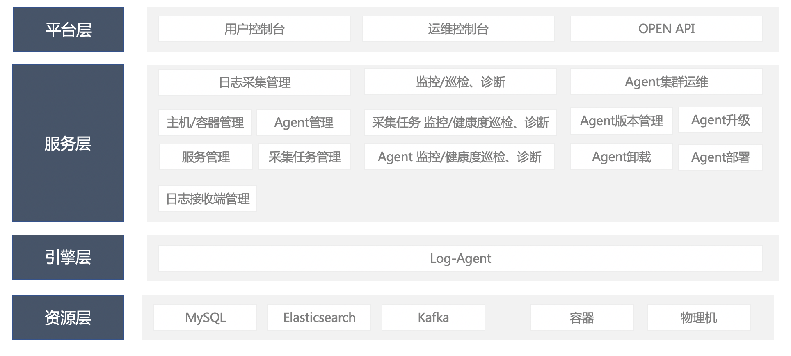

**面向云原生的一站式日志采集配置及运维平台**

阅读本README文档，您可以了解到滴滴LogiAM的用户群体、产品定位等信息，并通过体验地址，快速体验以“应用/服务”为采集粒度，从应用维度批量下发采集任务全流程。
若滴滴LogiAM已在贵司的生产环境进行使用，并想要获得官方更好地支持和指导，可以通过[OCE认证](http://obsuite.didiyun.com/open/openAuth)，加入官方交流平台。

# 1 产品简介

滴滴LogiAM来源于滴滴多年来大量的运维实践经验。经历过多方考验，对于大规模Agent日志采集治理管控及巡检诊断已经沉淀出一套完善的解决方案。在云原生时代背景下，LogiAM以“应用/服务”为采集粒度，满足了从业务层面创建采集任务的需求。

## 1.1 快速体验地址

- 体验地址 [http://116.85.23.35/](http://116.85.23.35/) 

## 1.2 用户体验地图

- 主机/容器管理：用于维护主机、容器信息至系统(含:容器-主机关系)
- 服务管理：用于维护服务信息至系统(含:服务-主机、服务-容器关系)
- 日志接收端管理：用于维护Agent上报的数据流、指标流、错误日志流需要写入的下游接收端信息(目前接收端类型仅支持kafka)
- Agent管理：用于维护Agent信息(含:Agent指标流、错误日志流对应下游的接收端信息、Agent限流信息等) ，Agent被部署、启动后，会自动向管理平台进行注册，注册成功后，即可进行对应管理，**注意：Agent注册前，请在平台维护好Agent宿主机信息**
- 日志采集任务管理：用于面向服务配置采集任务，配置好的采集任务通过服务找到部署该服务的主机/容器集，针对采集这些主机、容器的Agent集，进行日志采集任务下发 
- Agent指标查看：用于查看Agent运行时全景指标
- 日志采集任务指标查看：用于查看日志采集任务在各Agent上运行时全景指标
-  Agent健康度巡检：基于Agent运行时指标对Agent是否运行健康进行检查
- 日志采集任务健康度巡检：基于日志采集任务在各Agent运行时指标对日志采集任务是否运行健康进行检查

## 1.3 核心优势

- 稳定可靠的采集引擎：基于滴滴内部多年来沉淀的经验，在多年、数千个应用、数十万台机器，各核心业务场景的锤炼打磨下，在采集业务层面足够稳定成熟
- 便捷的日志采集配置能力：通用场景下尽量少的配置，配置所见即所得
- 高效的问题诊断、定位能力：具有卓越的指标诊断体系，将Agent、日志采集任务运行时状态全景数字化呈现，实时监控Agent及采集任务健康度，提供故障诊断功能并开具相应诊断报告，可高效快捷的实现问题定位
- 强大的运维能力：基于滴滴多年各核心业务、海量Agent与采集任务的运维经验，对于超大规模Agent与采集任务的治理管控及巡检诊断已经沉淀出一套完善的解决方案。实时查看运维任务，便于运维人员把控运维任务进度及状态

## 1.4 滴滴Logi-Agent架构图

# 2 相关文档
## 2.1 产品文档
