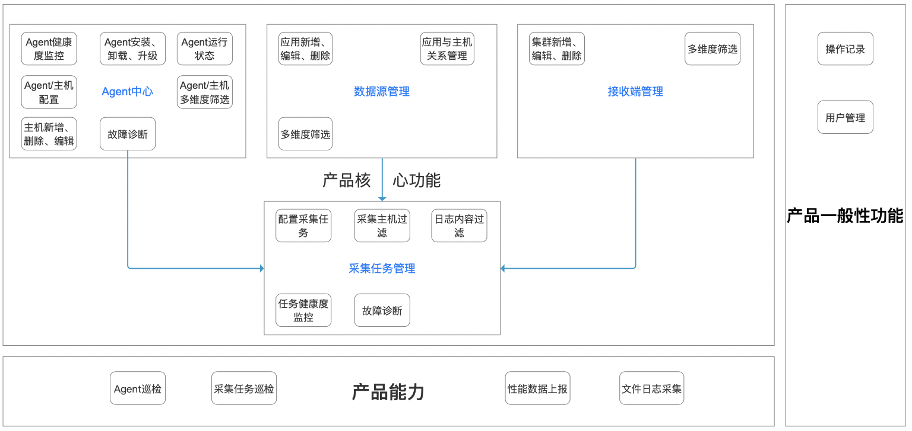
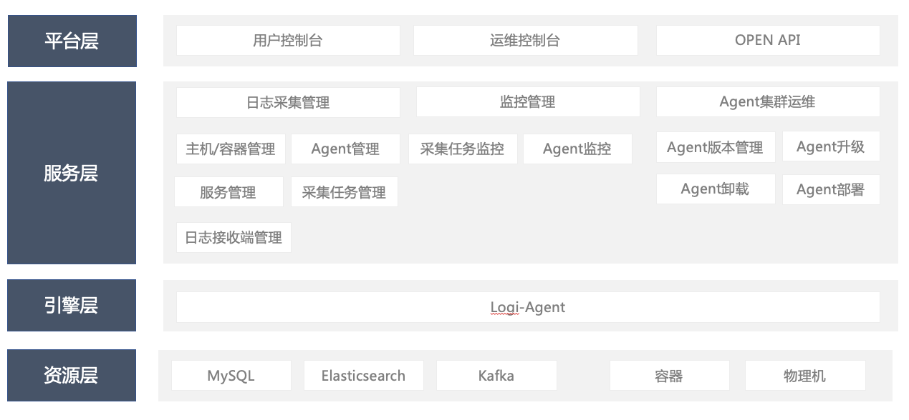

# Know Agent的特性

Know Agent是一款在混合云、容器化时代背景下，创新性提出以“服务/应用”为采集粒度的日志采集平台，主要有如下几个特性。

## 功能齐全

- Agent集中管理：主机一体，对接夜莺完成对Agent的安装、版本升级及卸载功能；
- 数据源管理：关联主机批量下发采集任务；
- 接收端管理：接入Kafka集群；
- 采集任务：以应用为采集粒度，灵活配置采集任务。

## 采集业务稳定

- 基于滴滴内部的采集引擎，多年来经过多方考验及打磨，积累了海量经验；
- 大量的运维实践，对于大规模治理管控及巡检诊断已经沉淀出一套完善的解决方案；
- 支持文件类型的日志采集，目的是更专注于保障核心采集业务的稳定性；
- 条带化采集，解决磁盘冲突问题，优化负载均衡，提高采集效率。

## 运维能力强大

- 基于滴滴多年海量设备运维经验，有完善卓越的指标诊断体系；
- 实时监控Agent健康度，灵活查看Agent运行状态及数据指标，提供故障诊断功能并开具相应诊断报告；
- 实时监控采集任务健康度，灵活查看采集任务运行状态及数据指标，提供故障诊断功能并开具相应诊断报告；
- 实时查看运维任务，便于运维人员把控运维任务进度及状态。

# Know Agent和主流日志采集类产品的对比

如下是Know Agent和主流的日志采集类产品之间的对比。

| 特性                       | 日志易 | 爱数 | 潘多拉 | 阿里云 | Know Agent |
| :------------------------- | :----- | :--- | :----- | :----- | :--------- |
| Agent健康诊断              | √      | ×    | ×      | ×      | √          |
| 采集任务诊断               | ×      | ×    | ×      | ×      | √          |
| Kafka接入                  | √      | ×    | ×      | ×      | √          |
| Docker容器采集             | √      | ×    | ×      | ×      | √          |
| 从应用维度批量下发采集任务 | ×      | ×    | ×      | ×      | √          |

## 为什么选择Know Agent？

已经有那么多优秀的日志采集类产品，滴滴为什么还要开源Know Agent呢？

\1. 随着混合云与容器时代的来临，用户对于“应用/服务”维度的数据的需求越来越多，且日志数据对于提升运维、运营效率，快速查找和定位问题十分关键，而市面上大多数同类产品还不具备这类功能而且定位问题的能力较弱。

\2. 市面上同类产品的指标监控体系还相对薄弱，大部分仅支持基本指标监控诊断，如CPU利用率、是否运行等，Know Agent基于滴滴多年海量设备运维经验，具有完善卓越的指标诊断体系，实时监控Agent及采集任务的运行指标及状态。

\3. 大部分日志采集类产品还只支持商业版，处于闭源状态。

基于上述几点，滴滴为了回馈社区，将沉淀多年的运维经验对外孵化，提供一套稳定成熟的日志采集体系，我们打算开源这款Know Agent产品。

# Know Agent的工作过程

Know Agent以“服务/应用”为采集粒度，通过将应用与主机关联批量下发采集任务



# 安装部署

**管理平台侧**

1. 解压缩安装包output.tar.gz，在MySQL终端运行agent-manager目录下ddl.sql文件中的内容，创建管理平台所需数据库表。

2. 修改配置文件application.yml： 

   

   ```
   spring.datasource.druid.url：数据库连接信息，将源连接ip、端口修改为对应数据库连接信息
   ```

   ```
   spring.datasource.druid.username：数据库用户名
   ```

   ```
   spring.datasource.druid.password：数据库用密码
   ```

   ```
   auv-job.jdbc-url：同配置项 spring.datasource.druid.url
   ```

   ```
   auv-job.username：同配置项 spring.datasource.druid.username
   ```

   ```
   auv-job.password：同配置项 spring.datasource.druid.password
   ```

3. 启动管理平台：sh start.sh

4. 停止管理平台：sh stop.sh

**agent 侧**

1. 解压缩安装包 output.tar.gz，在agent/conf/目录下，修改settings.properties文件：

   config.ip：管理平台部署的机器ip地址

   config.port：管理平台进程对应端口，见管理平台配置文件 agent-manager/application.yml 配置项 agentmanager.port.web 对应值（默认：8006）

2. 启动 agent：进入agent/bin/目录下，执行 sh start.sh 启动 agent

3. 停止 agent：进入agent/bin/目录下，执行 sh stop.sh 停止 agent


# 探究原理

如下是Know Agent的整体架构图，更详细的内容请大家阅读源码。


