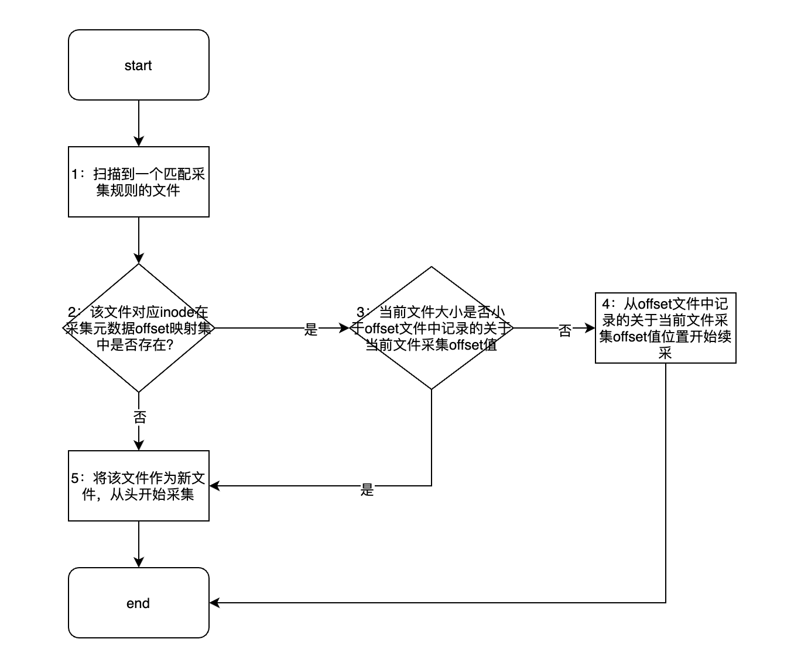
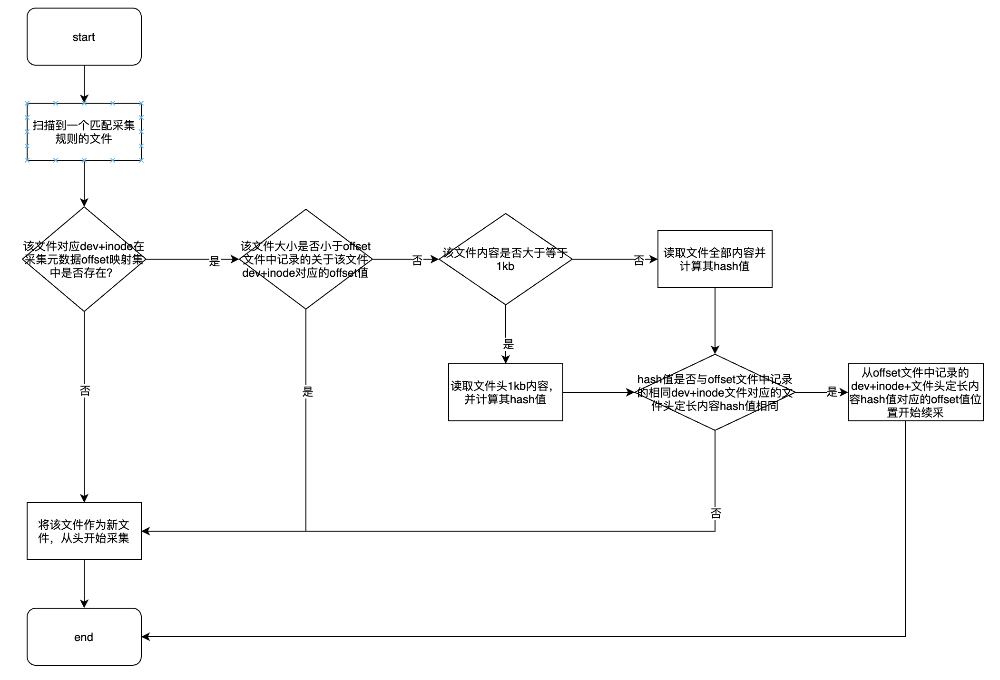

# 影响数据完整性的因素

- inode复用问题
- 文件采集或异步发送过程中出现宕机导致的数据丢失问题
- 元数据offset信息刷写的可靠性与元数据offset文件高可用问题
- 元数据offset信息被错误的清理问题

# LogAgent的解决之道

## inode复用问题

这里先看一下inode复用问题如何影响数据完整性的？

​	如上图，问题出在上图中的`步骤2`，对于日志滚动场景，如日志打印速度非常快，两次扫描过程中，该日志文件被归档、删除，然后新创建了一个文件，新创建文件inode与之前被归档、删除文件的inode一样（即：被复用），并且，新创建文件写入数据的速度非常快，超过了元数据offset映射集中记录的关于该inode对应的offset指，这个时候，采集引擎将会从元数据offset映射集中记录的关于该inode对应offset位置开始续采，此时，将导致数据丢失，完整性无法保证。

​	通过上述分析，可以发现其根本问题在于inode值无法全局定义一个文件，因而解决方案就是找到一种全局定义一个文件的方法，LogAgent的思路为：将文件头部内容作为文件唯一标识的一部分，采用的方案为：将`dev+inode+文件头定长内容hash`值作为定义一个文件的唯一值，默认定长值为1kb（1kb大小为反复实践得到的一个比较好的参考值）。LogAgent的处理逻辑如下图：

​	需要注意的是，如第一次扫描时，文件写入内容不足1kb，第二次文件扫描时，文件写入内容超1kb时，将导致第一次扫描时不足1kb的内容被重复采集。当然，该方案并不完美，该方案的目的只是尽可能降低inode复用误识别概率，理论上，文件头定长大小越大，出现inode复用误识别的概率越低，但可能会带来更多的重复性脏数据（第一次文件扫描时，文件内容长度不足文件头内容定长大小时），以及读取文件头部内容导致的io开销也会相应增大。

## 文件采集或异步发送过程中出现宕机导致的数据丢失问题

LogAgent采用如下机制进行保证：

- 一个文件在一次采集周期（从文件打开到关闭）内，始终被一个采集线程进行采集。
- 一个sink线程仅对应一个采集线程。
- 一个处于正在被采集的文件，仅当同时满足如下三个条件时，才可被关闭：
  - 已读取到文件末尾
  - 该文件持续一段时间未读出数据
  - 该文件读取到的所有LogEvent都已发送下游接收端成功
- 对于采集到的每个LogEvent对象，内置其关联的fd对象（表示该LogEvent由该fd对应的文件采集产生）、与其在fd对应文件的offset。
- 采集流程：一个LogEvent被采集线程采集并创建后，投送至该采集任务对应channel，由采集线程关联的sink线程取出，每个channel维护一个Map<fd, maxOffset>，用于记录采集线程上一次flush ~ 本次flush间，channel中取出的所有元素对应的fd及fd最大offset映射集，每个sink线程也维护一个Map<fd, minOffset>，用于记录该sink线程对应的kafkaProducer所有发送失败元素对应的fd及fd最小offset映射集，采集线程将根据条件（间隔时间、logEvent数量、logEvent总大小）周期性的进行flush，flush 流程为：
- 发送完channel剩余元素：采集线程找到任意一个其关联的sink线程，sink线程将channel中剩余元素全部扔进kafkaProducer缓冲区，然后调用kafkaProducer的flush接口，将channel剩余元素同步写入下游kafka。如kafkaProducer的flush接口调用失败，执行如下操作：以fd为粒度,将失败的所有logEvent中最小offset记录保存至sink线程对应Map中(如fd在map存在,对比offset,存放最小offset)。
  - 发送完各sink缓冲区中的元素：采集线程获取其关联的所有sink，调用kafkaProducer的flush接口同步发送对应sink线程、kafkaProducer缓冲区内的所有元素，流程同上。
- 采集线程获取其关联的所有sink线程，检查各sink线程关联的Map是否都为空：
    - 都为空：表示发送成功，此时，将进行offset提交，将channel关联的map元素提交至全局offset map，清空channel map。
  - 一个或多个sink map不为空：表示发送过程存在失败，此时，将进行offset回滚：将所有 sink 线程对应 Map 中的记录取出，以fd为粒度，找到各fd对应offset最小值，然后将各<fd, minOffset>最提交至全局 offset map，清空 channel 级 offset map。
-  元数据刷写线程周期性将全局 offset map 序列化并写入元数据offset文件中。

## 元数据offset信息刷写的可靠性与元数据offset文件高可用问题

- 借助Linux内核提供原子rename。一个文件可以原子的rename成另外一个文件，利用这个特性可以保证offset文件高可用。假设已存在一个offset文件叫做offset.json，每一秒我们去更新这个offset.json文件，将采集的各文件位置实时的记录在里面，整个更新的过程如下：
  - 将全局 offset map 序列化并写入磁盘offset.bak文件中
  - 调用 fdatasync 确保数据写入到磁盘
  - 通过 rename 系统调用将 offset.bak 更名为 offset.json

​	通过上述方式可确保在任何时刻元数据offset信息刷写的可靠性与元数据offset.json文件的高可用，因为每次写入都会先确保写入到临时文件是成功的，然后原子的进行替换。这样就保证了offset.json文件总是可用的。在元数据offset信息1秒1次刷写频率下，极端场景下会导致1秒内的点位没有及时更新，日志采集Agent启动后会再次采集这1秒内的数据进行重发，满足at-least-once。

## 元数据offset信息被错误的清理问题

在日志滚动采集场景，元数据offset信息随着文件越滚越多，也会越来越大，如何正确的清理元数据offset信息就成为了一个问题，如下这些情况下，元数据信息`fd-offset`需要被清理：

- 采集任务被删除：被删除采集任务所涵盖的所有采集路径匹配到的所有文件对应元数据信息`fd-offset`都会被清理。
- 采集任务包含的采集路径被删除或变更：被删除或变更的采集路径匹配到的所有文件对应元数据信息`fd-offset`都会被清理。
- fd对应文件不存在（如：被归档、或删除）：元数据fd对应文件不存在时，该元数据信息`fd-offset`会被清理。
- fd对应文件的最后修改时间距当前时间间隔超过设定的offset超时阈值：该fd对应元数据信息`fd-offset`会被清理。

