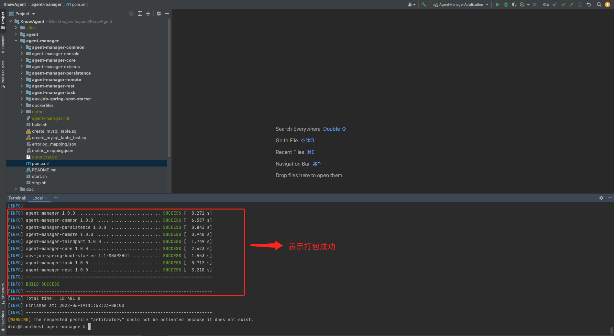
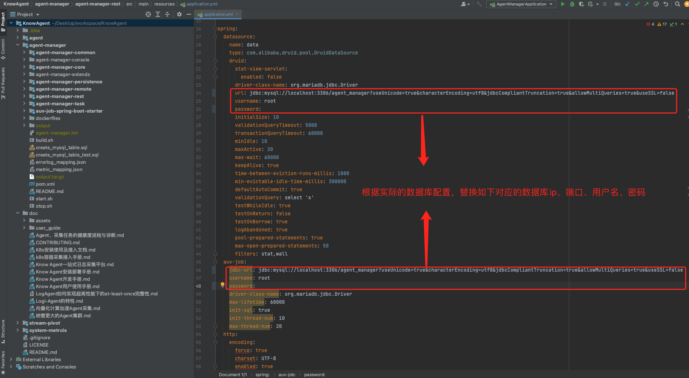
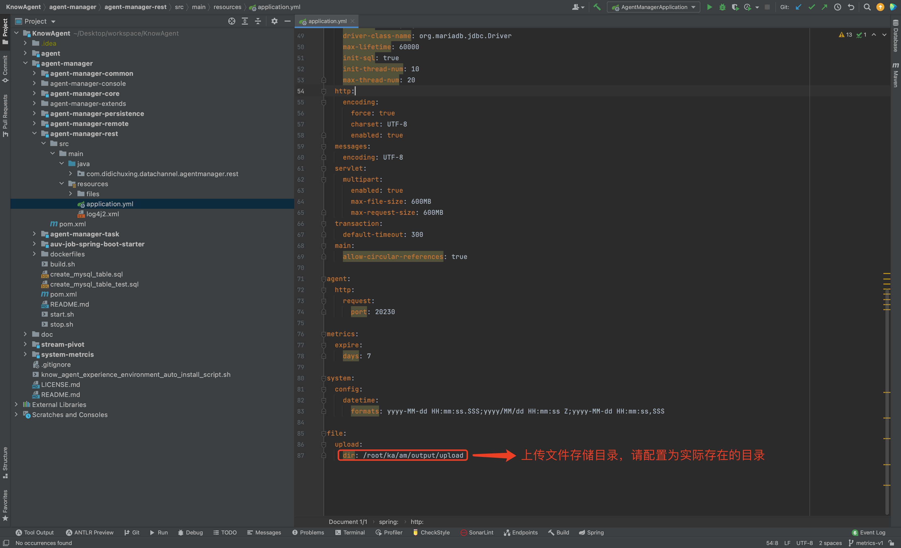
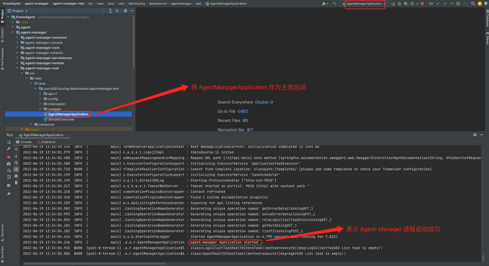
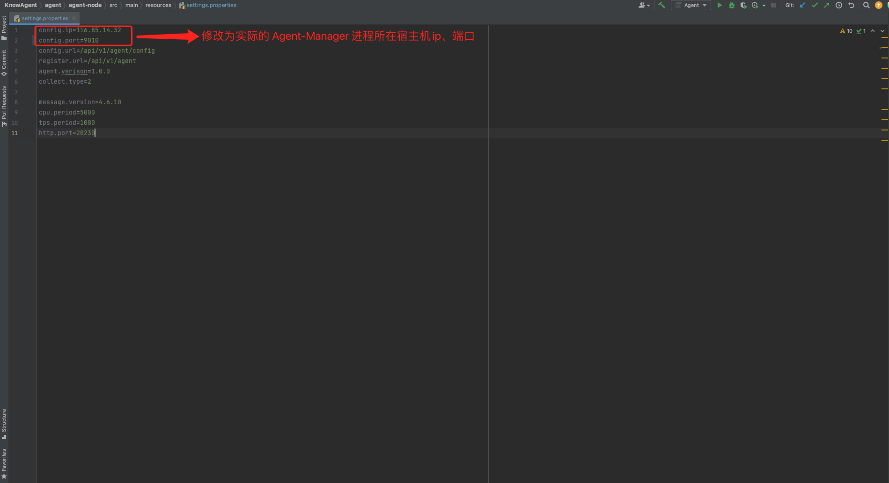
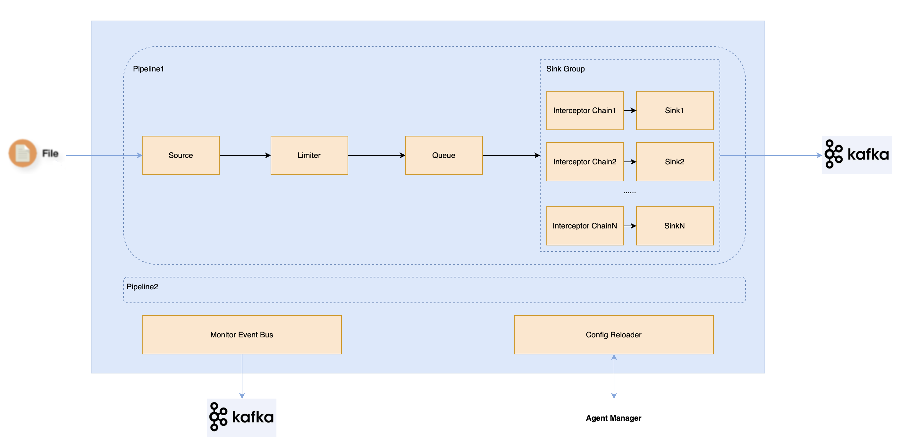
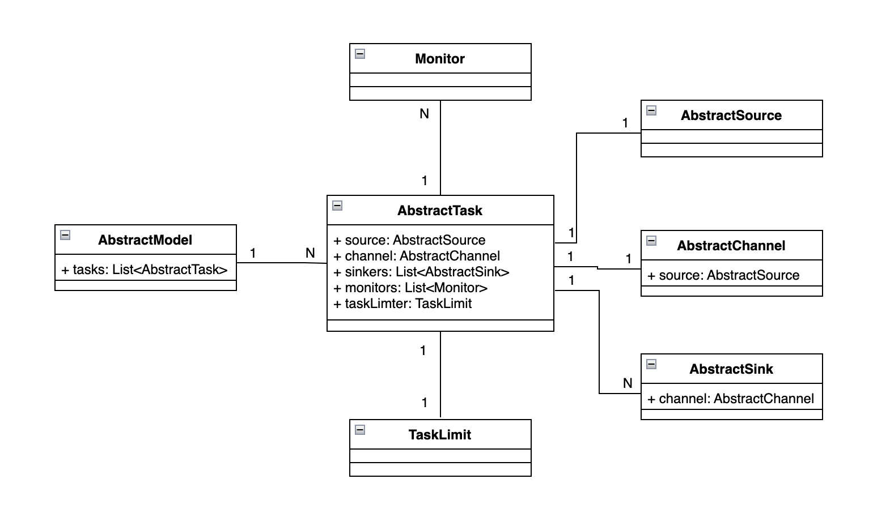

# 1 项目依赖说明

​	`Agent`项目依赖`Agent-Manager`项目，`Agent-Manager`项目依赖`System-Metrics`项目，因而在项目编译、打包时，需要注意顺序，在下面的**开发环境搭建**部分会有详细说明。

# 2 开发环境搭建

## 2.1 Agent Manager 本地开发环境搭建

### 2.1.1 环境准备

#### 2.1.1.1 环境依赖

- `Java 8+`
- `Maven 3.5+`
- `Node 14.15.1 (前端环境)`
- `Mysql 5.7+ (数据存储)`
- `kafka 2.3+`
- `IDEA`

#### 2.1.1.2 数据库初始化

​	执行`agent-manager`目录中的`create_mysql_table.sql`这个sql文件，初始化mysql表。

```
# 示例：
mysql -uXXXX -pXXX -h XXX.XXX.XXX.XXX -PXXXX < ./create_mysql_table.sql
```

#### 2.1.1.3 依赖项目 System-Metrics 编译、打包

​	进入`system-metrcis`目录，执行`mvn clean install`命令。

### 2.1.2 本地启动

​	因为本地直接使用`IDEA`启动，并不会将前端资源文件生成，因此在第一次启动之前，需要在`agent-manager`目录下执行`mvn clean install -DskipTests`命令，将前端的静态资源文件打包出来。命令执行完成以后，修改`application.yml`配置文件，然后点击启动，本地启动成功之后，访问 http://localhost:9010。具体的`IDEA`启动及配置见图：

#### **2.1.2.1 IDEA 打包**



#### **2.1.2.2 修改 application.yml 配置文件**





#### **2.1.2.3 启动 Agent-Manager**



## 2.2 Agent 本地开发环境搭建

### 2.2.1 环境准备

#### 2.2.1.1 环境依赖

- `Java 8+`
- `Maven 3.5+`
- `kafka 2.3+`
- `IDEA`

**注意：在搭建 Agent 本地开发环境前，请先对`Agent-Manager`项目进行 Maven 打包、安装。**

### 2.2.2 本地启动

#### **2.2.2.1 修改 conf/settings.properties 配置文件**



#### **2.2.2.2 启动 Agent**


# 3 KnowAgent 简要介绍

## 3.1 Agent 

### 3.1.1 架构



### 3.1.2 各模块介绍

| 模块                   | 说明           | 详细说明                                                     |
| ---------------------- | -------------- | ------------------------------------------------------------ |
| agent-node             | Agent 启动模块 | Agent 启动功能相关的类，Agent 启动类`Agent`在该模块中        |
| agent-engine           | 核心引擎模块   | 日志采集核心流程相关的接口、抽象类（如：AbstractTask、AbstractSource、AbstractSink、AbstractChannel） |
| agent-task             | Task 模块      | Task 的具体实现 Log2KafkaTask 相关类                         |
| agent-source           | Source 模块    | Source 的具体实现 LogSource 相关类                           |
| agent-sink             | Sink 模块      | Sink 的具体实现 KafkaSink 相关类                             |
| agent-channel          | Channel 模块   | Channel 的具体实现 LogChannel 相关类                         |
| agent-common           | 公共模块       | 公共的常量类、枚举类等                                       |
| agent-integration-test | 一体化测试模块 | Agent 一体化测试相关的功能类、测试类                         |

### 3.1.3 核心 E-R 图



## 3.2 Agent-Manager

### 3.2.1 架构


### 3.2.2 各模块介绍

| 模块                      | 说明           | 详细说明                                                     |
| ------------------------- | -------------- | ------------------------------------------------------------ |
| agent-manager-rest        | Web 模块       | API 接口层，Agent-Manager 启动类`AgentManagerApplication`在该模块中 |
| agent-manager-core        | 核心业务模块   | 核心业务层，围绕核心 E-R 的处理流程，在核心 E-R 不出现大的变动情况下，该模块保持稳定 |
| agent-manager-persistence | 数据持久化模块 | 数据访问层，读、写 MySQL                                     |
| agent-manager-common      | 公共模块       | 公共的 POJO 类、常量类、枚举类、工具类等                     |
| agent-manager-task        | 定时任务模块   | 基于MySQL、抢占式的一个定时任务的负载均衡及执行模块，用于执行既有定时任务 |
| agent-manager-extends     | 扩展模块       | 封装一些可能会变动的功能接口                                 |
| agent-manager-remote      | 远程访问模块   | 封装一些用于与其他系统进行交互的功能接口                     |
| agent-manager-console     | 前端模块       | 前端相关代码、静态资源文件                                   |

### 3.2.3 核心 E-R 图


