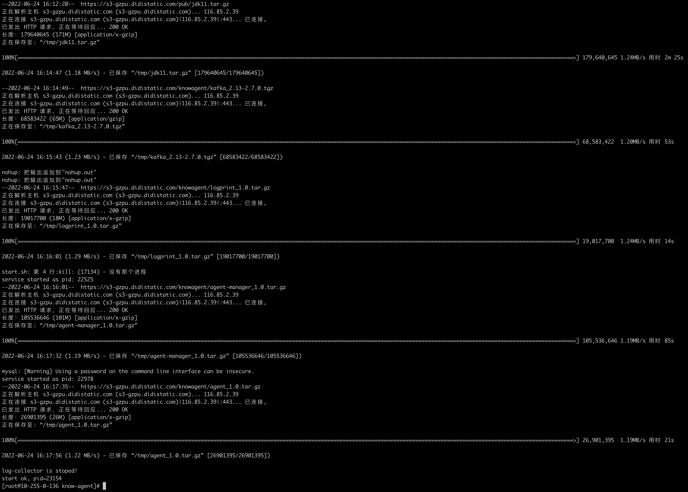

# 1 安装环境准备

- 操作系统：Linux CentOS 7+ 
- 环境：
  - 具备 root 权限
  - yum 命令可用
- 物理资源：
  - CPU：4 Cores+
  - Memory：8 GB+
  - Disk：100GB+

# 2. 安装部署

​	如您准备的安装环境具备外网连接能力，且具备稳定的网络环境与良好的网速，建议您采用`在线安装`模式，否则，建议您采用`离线安装`模式。

## 2.1 在线安装

### 2.1.1 创建安装目录	

​	在需要安装 Know Agent 一站式体验环境的主机上创建用于存放 Know Agent 一站式体验环境所需的各组件安装包的目录，如下图：

### 2.2.2 拷贝安装脚本至安装目录

​	请将[《Know Agent一站式体验环境一键安装脚本》](../know_agent_experience_environment_auto_install_script.sh)拷贝至上一步创建的安装目录中，如下图：

### 2.2.3 执行安装脚本

​	执行`sh know_agent_experience_environment_auto_install_script.sh`命令运行 Know Agent 一站式体验环境一键安装脚本，开始 Know Agent 一站式体验环境的安装、配置。遇到 “Do you need to install MySQL（yes/no）”，请输入 “yes”，如下图：

	Know Agent 一站式体验环境安装成功，如下图：

## 2.2 离线安装

### 2.2.1 下载离线安装包

1. ​	在需要安装 Know Agent 一站式体验环境的主机上，创建安装目录。
2. ​	请下载离线安装包并将离线安装包拷贝至安装目录中（离线安装包下载地址：https://s3-gzpu.didistatic.com/knowagent/knowagent_package.tar.gz）。
3. ​	在安装目录下，执行`tar -xf knowagent_package.tar.gz`命令解压离线安装包。
4. ​	在安装目录/knowagent_package/目录下，执行`sh know_agent_experience_environment_auto_install_script.sh`命令运行 Know Agent 一站式体验环境一键安装脚本，开始 Know Agent 一站式体验环境的安装、配置，其余步骤同在线安装流程。

# 3. 开始体验

## 3.1 进入 Agent-Manager 管理平台

​	打开浏览器，输入地址：http://请替换为KnowAgent一站式体验环境安装主机ip:9010，即可进入 Agent-Manager 管理平台。

## 3.2 体验各项功能

​	见[《Know Agent用户使用手册》](know_agent_user_manual.md)。