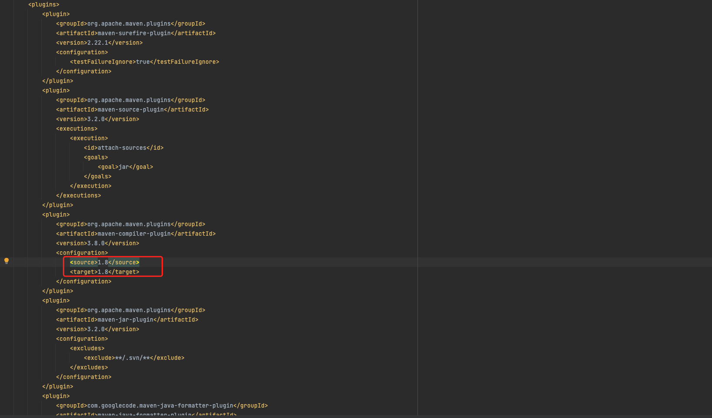

# 1 Agent Manager

## 1.1 环境准备

- java 8 （运行环境）
- MySQL 5.7 （数据存储）
- Maven 3.5+ （后端打包依赖）
- node 14.15.1+ （用于打包依赖，其中npm版本6.14.8）

## 1.2 源代码编译打包

1. 在编译打包 `Agent-Manager` 项目前，请先对`System-Metrics`项目进行编译打包。
   - `System-Metrics`项目编译打包方法：进入`system-metrcis`目录，执行`mvn clean install`命令。
2. 进入`agent-manager`目录，执行`sh build.sh`命令，得到output目录。

## 1.3 MySQL-DB初始化

​	进入`agent-manager`目录，执行[create_mysql_table.sql](../agent-manager/create_mysql_table.sql)中的SQL命令，从而创建所需的MySQL库及表，默认创建的库名是`agent_manager`。

```
# 示例：
mysql -uXXXX -pXXX -h XXX.XXX.XXX.XXX -PXXXX < ./create_mysql_table.sql
```

## 1.4 配置文件修改

```
# application.yml 是配置文件，最简单的是仅修改MySQL相关的配置即可启动
spring.datasource.druid.url：数据库连接信息，将源连接ip、端口修改为对应数据库连接信息
spring.datasource.druid.username：数据库用户名
spring.datasource.druid.password：数据库用密码
auv-job.jdbc-url：同配置项 spring.datasource.druid.url
auv-job.username：同配置项 spring.datasource.druid.username
auv-job.password：同配置项 spring.datasource.druid.password
```

## 1.5 启动与停止

​	在`output`目录下，执行`sh start.sh`即可启动 Agent-Manager 进程，执行`sh stop.sh`即可停止 Agent-Manager 进程。

## 1.6 使用

​	本地启动的话，访问`http://localhost:9010`。更多参考：[《Know Agent用户使用手册》](know_agent_user_manual.md)

# 2 Agent

## 2.1 环境准备

- java 8+ （运行环境）
- Maven 3.5+ （后端打包依赖）

## 2.2 主机名设置

​	在安装 Agent 前，请设置好需要安装 Agent 的主机对应主机名，并确保该主机名是唯一的。

## 2.3 源代码编译打包

1. 在编译打包 Agent 项目前，请先对`Agent-Manager`项目进行编译打包。
   - `Agent-Manager`项目编译打包方法见上文`Agent-Manager`部分。
2. 进入`agent`目录，执行`sh build.sh`命令，得到output目录。

## 2.4 配置文件修改

```
# conf/settings.properties 是配置文件，最简单的是仅修改Agent-Manager平台的相关配置即可启动
config.ip=运行Agent-Manager服务的机器ip
config.port=Agent-Manager服务配置的http端口（默认：9010）
```

## 2.5 启动与停止

​	在`output`目录下，执行`sh start.sh`即可启动 Agent 进程，执行`sh stop.sh`即可停止 Agent 进程。

## 2.6 更高性能

​	采用 jdk11+ 将会大幅提升采集性能（感兴趣可移步[《向量化计算加速Agent采集》](向量化计算加速Agent采集.md)），具体方式如下：

1. 安装 jdk11+。
2. 进入`agent`目录，打开 pom.xml 文件，将编译版本从1.8改为实际安装的jdk版本，如下图。
3. 按上述流程，对 Agent 项目进行编译打包。


