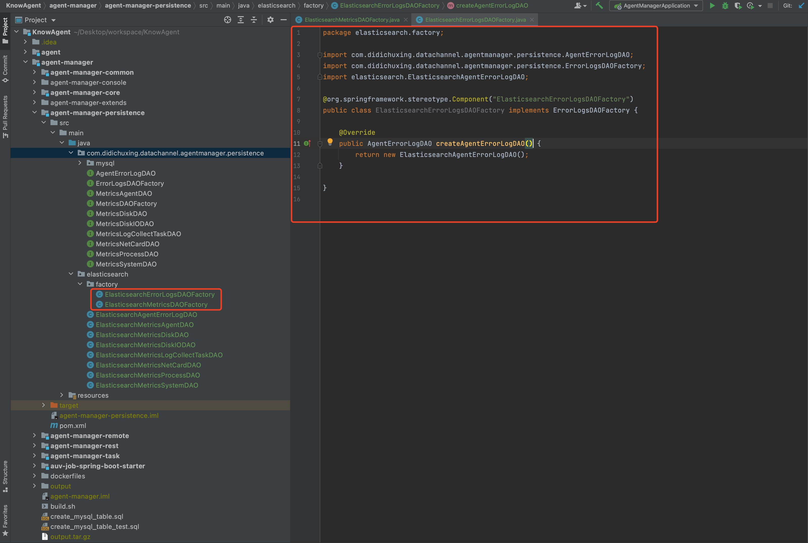
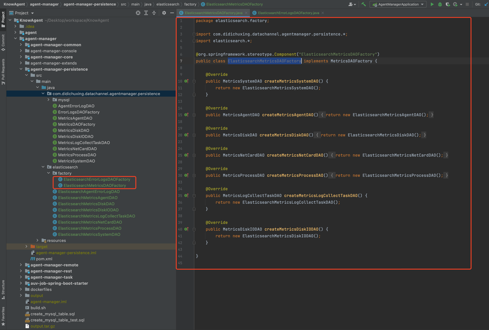
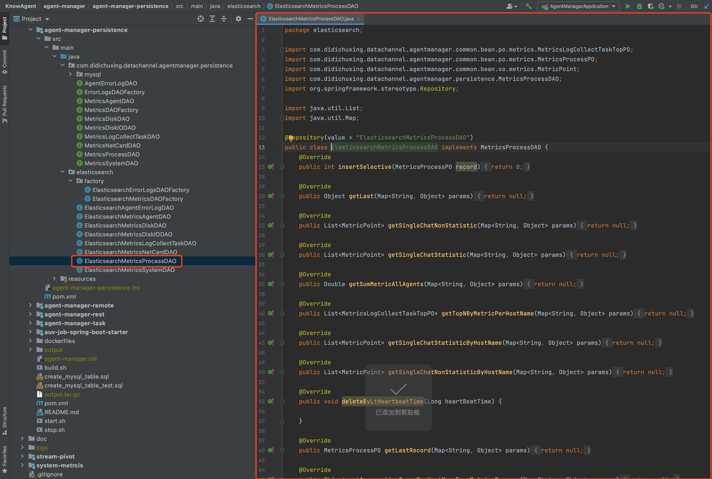
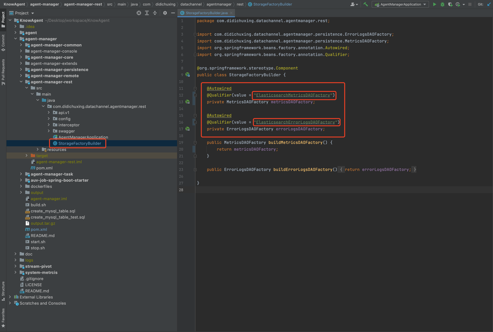

	Know Agent 基于最小依赖、便于体验，采用 MySQL 存储 Agent 的 Metrics 与 Error Logs 数据。受制于 MySQL 性能瓶颈，在单个采集任务对应一个采集路径、Metrics 与 Error Logs 数据保存周期为一周的情况下，支持 50 个 Agent 与 50 个采集任务的管控。如需要管控更多的 Agent 与采集任务，用户可通过如下 3 个步骤自行扩展更多类型的存储引擎用于存储 Agent 的 Metrics 与 Error Logs 数据。

​	以扩展 Elasticsearch 作为 Agent 指标数据与错误日志数据存储引擎为例：

1. 在`agent-manager-persistence`项目中，创建 Elasticsearch 对应的 `MetricsDAOFactory` 与 `ErrorLogsDAOFactory` 接口实现类，如下图：

   

   

2. 在`agent-manager-persistence`项目中，创建`MetricsDAOFactory`与 `ErrorLogsDAOFactory` 接口中需要创建的各 DAO 接口实现类，如下图：

   

   

   

   

   

   

   

   

   **注意：以上，仅给出实现类的定义，并未具体实现，无法直接使用。具体实现逻辑可参考MySQL相关实现。**

3. 在`agent-manager-rest`项目中，修改 `StorageFactoryBuilder` 类中关于`MetricsDAOFactory`与`ErrorLogsDAOFactory`对象注入名为第一步中创建的 Elasticsearch 对应的 `MetricsDAOFactory` 与 `ErrorLogsDAOFactory` 接口实现类上的注解名，如下图：

   