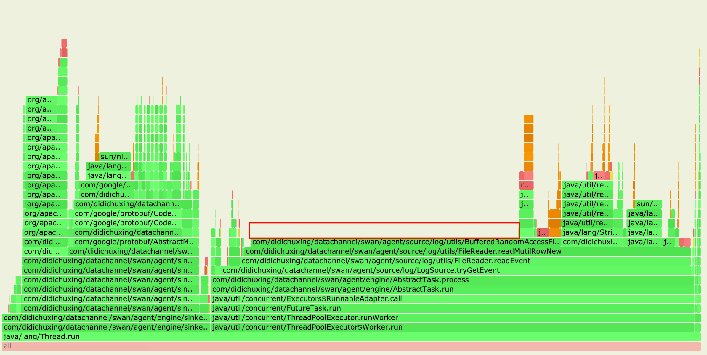

# 背景

​	鉴于Agent的架构，sink部分可通过多sink组件的方式进行性能提速，最终性能瓶颈点在于source部分，在此之前，单文件峰值的采集性能已达70MB/s，如何突破source部分性能瓶颈进而进一步提升采集性能？这个是我们目前需要解决的问题。

# 瓶颈点 - 难搞的换行符

​	Agent的逻辑说简单也很简单，将日志文件按行读出来，按照配置里的参数解析出日志时间，连同采集相关属性打包发送到消息队列。
但是问题就出在了【按行读取】上了，如果想将一个文件按行读出来，就需要遍历每一个字符判断是否为换行符

```java
while((c = nextChar()) != '\n') {
  result.append(c); 
}
```

一次循环中有3次操作，读出一个字符 -> 和'\n'比较 -> false写入当前行，所以匹配换行符这个操作就会消耗掉非常多的计算资源，打印出的火焰图也能验证这一点，最长的一段就是在循环匹配换行符的地方。



# SIMD与向量化执行

​	在解决如何更加高效的匹配换行符的问题前，还要稍微了解一下现代CPU是怎样工作的。

```java
int[] source1;
int[] source2;
for(int i = 0; i < origin.length; i++) {
  dest[i] = source1[i] + source2[i];
}
```

​	现在的CPU都是支持SIMD指令的，即单指令多数据流（Single Instruction Multiple Data），通过一条指令就可以完成对多个数据的计算，这些指令使用特殊的CPU寄存器，长度有128位xmm(SSE), 256位ymm(AVX2), 512位zmm(AVX512)。简单来说，理论上一条指令可以完成最多512位数据的计算，如果每条指令只算了一次add是对cpu性能的浪费。
如果想挖掘性能的话有2个方向：

1. 根据厂商提供的指令手册基于C或汇编编写高性能的代码，但是对开发人员要求更高，而且对于java这种跨平台语言也没办法使用。
2. 依赖编译器对代码进行自动向量化，但是只限于上边这种非常简单的例子。

# HotSpotIntrinsicCandidate

​	在jdk9之后，jdk内置的很多函数都有`@HotSpotIntrinsicCandidate`这个注解，他的含义是在JVM会尝试将此函数实现替换为基于CPU指令的更加高效的实现方式。
例如我们看`StringLatin1.indexOf`函数，会调用到这个函数

```java
@HotSpotIntrinsicCandidate
public static int indexOf(byte[] value, int valueCount, byte[] str, int strCount, int fromIndex)
```

​	内容看起来只是普通的字符串匹配的java代码，但实际运行时会替换为基于SSE4.2指令集中的PCMPESTRI指令，在16字节内的字符中查找另一个16字节以内的字符，并返回命中时的索引。相比之前的单个字符配置，理论性能差距有16倍。

现在jdk中有几百个Intrinsic函数，可以在[JDK代码](http://hg.openjdk.java.net/jdk/hs/file/46dc568d6804/src/hotspot/share/classfile/vmSymbols.hpp#l727)中找到函数的列表，使用这类函数可能使程序的性能获得大幅提升。

# Agent优化思路

​	现在采集速度的瓶颈主要就是每次只读了一个字节判断并写到结果中，理论上换行符匹配和数据复制都是可以向量化执行的，我们需要修改这部分的逻辑。可以一次读出一批数据，寻找换行符所在位置，并把在换行符前的数据一次性批量写入结果中，而不是一个字节一个字节的复制。
如何寻找换行符，这里还有两个思路，

1. 利用编译器的自动优化，在有界循环内的简单操作，在JIT时会优化成向量化执行
2. 利用`String.indexOf`内的字符查找函数，但是因为是private函数需要反射调用，会有额外开销

​	之后的编写一些测试的case，对比这两种和原本的方式性能会有多大的差别。


​	这个测试结果图标可以得出几个结论

1. 以单字符读取，无法向量化执行，速度最慢
2. 依靠编译器优化也非常有效，随着批量读取的大小加大，最终极限速度可以到1200MB/s
3. 依靠jdk中自带的字符查找函数，速度最优，可以达到2200MB/s
4. 单次匹配的大小在256B左右最优，加大并没有明显提升

# 优化结果

​	使用jdk11优化代码逻辑后，通过配置测试采集任务进行性能测试，对比结果在cgroup限制为1核和不限制的情况下单文件采集速度

|        | 单核   | 不限制cpu      |
| ------ | ------ | -------------- |
| 优化前 | 25MB/s | 67MB(2.4核)    |
| 优化后 | 40MB/s | 180MB（4.6核） |

因为Agent的架构分为source(按行读取文件)和sink(序列化写入消息队列)，而sink是可以增加并发数的。之前的版本受限于文件读取的速度，极限的采集速度在70M左右，优化后因为读取速度不再是瓶颈，极限速度可以达到200M以上。
优化后单核采集性能可以提升大约60%，或者换一种说法，采集同样的日志数据，优化后Agent的cpu消耗可以降低40%。