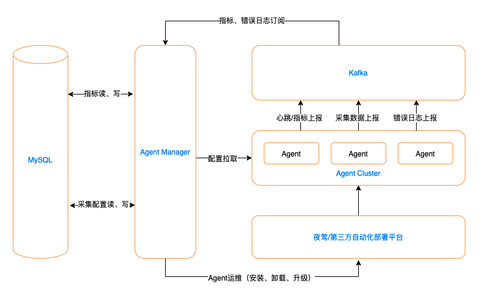
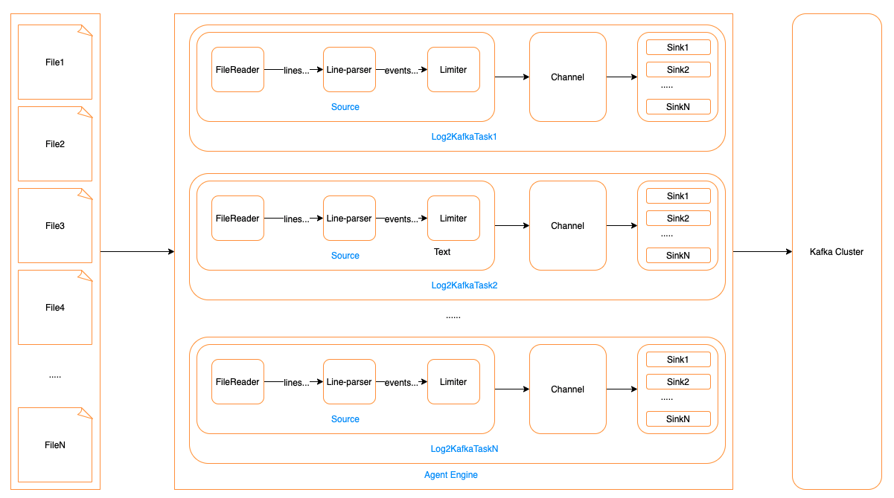
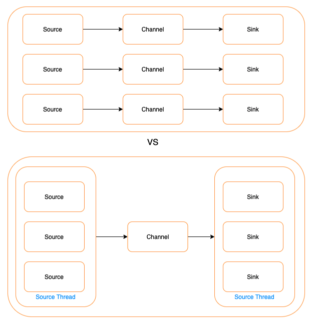

# 滴滴开源Logi-AM 一站式日志采集平台

Logi-AM脱胎于滴滴内部多年的Agent运营实践经验，是面向Agent用户、Agent运维人员打造的Agent一站式采集平台。专注于日志采集、Agent运维管控、资源治理等核心场景，经历数年、各核心业务场景、超大规模Agent集群、海量大数据的考验。

滴滴内部统一使用 Logi-Agent 作为日志采集器，当前滴滴共有100k+的Agent，20k+采集任务，每天万亿/PB级的日志采集量，单Agent线上最大持续采集流量达50mb+/s；Agent用户需要完成采集任务创建下发、指标查看等操作；运维人员还有大量Agent集群运维操作。因此我们需要构建一个Agent管控平台来承载这些需求。

在Logi-AM建设的初期，我们调研了社区同类产品的使用情况，在调研中发现，外部同类产品无论在采集可靠性、采集性能、数据完整性、数据采集有序性、监控指标的完善程度、运维管控的能力亦或是使用的体验上都无法很好的满足我们的需求，因此自建滴滴 Logi-AM 平台势在必行。

免费体验地址：http://116.85.23.35/agent。

## 需求分析

在 Logi-AM 建设初期，我们对之前所面临的问题和需求进行了归纳分析，主要有以下几点：

### Agent引擎侧

- **高可靠性**

  在持续的超大流量采集情况下如何确保稳定、可靠的数据采集，这是采集器首要解决的问题。

- **高性能**

  滴滴内部有部分场景日志量特别大，单机每秒持续产生待采集日志达50mb+，如何确保这些日志能被及时的采集上来，这就要求采集器的整体采集性能必须远超50mb+/s，并具备可持续性。

- **数据完整性**

  如 inode 复用问题，异步发送情况下即使出现发送失败、异常宕机等各种异常情况下，采集器必须确保数据不丢失（at-least-once），从而确保数据完整性。

- **数据有序性**

  让我们回答一个问题：“10：00 am. 前的日志是否已采集完”？这个问题涉及到两个点：

  1. 用户打印日志需要按时序顺序打印，不可乱序
  2. 采集器采集日志时须按照用户打印顺序进行按序采集并输出到下游

  因此，确保日志按打印顺序被采集上来并输出到下游，是采集器必须要做到的。

- **监控指标的完善程度**

  Agent运行过程数据化、指标化，是Agent智能运维的基础，如何将Agent运行过程数据化，如何定义黄金指标，这是Agent监控指标体系构建的关键。

### Agent-Manager平台侧

- **稳定性**

  滴滴内部Agent-Manager平台需要管控的Agent多达100k+，采集任务多达20k+，所有Agent每隔30秒会向Agent-Manager平台拉取一次采集配置，Agent-Manager平台需要周期性的对所管控的全量Agent与采集任务做健康度巡检、诊断，这种情况下如何确保Agent-Manager平台的稳定、可靠？这是Agent-Manager平台首要解决的问题。

- **问题定位高效性**

  海量的Agent、采集任务在日常运行中可能会遇到各种问题，如：日志打印规则与配置的日志切分规则不匹配、单条日志过长、日志打印的时序错乱、日志采集延时过大、Agent频繁重启、Agent Fullgc 严重导致Agent cpu 消耗过大等等，Agent-Manager如何通过Agent上报的指标进行健康度周期性巡检、诊断，并辅助用户进行智能排障，做到真正的咖啡运维？这是Agent-Manager平台必须要做到的，也是Agent-Manager面向海量Agent、采集任务管控场景下最具价值的功能之一。

- **部署、运维便利性**

  在日常的运维中，会存在着大批量Agent运维操作（批量安装、升级、卸载），如：大批量Agent升级操作是一个危险且工作量极大的工作，如何引导用户进行灰度升级？升级失败如何引导用户查看失败原因进行排障并进行回滚？这也是Agent-Manager需要解决的问题。

- **云原生的支持**

  面向云原生的场景，如何通过接入的k8s元数据构建起“主机-容器-服务”三者之间的关系？如何让用户在Agent-Manager平台上针对容器方便的配置基于服务的日志采集？如何在容器漂移的场景下，确保容器漂移后，漂移前生成的日志被可靠的采集完并正确下线针对漂移容器的采集任务？这是Agent-Manager平台必须具备的能力。

- **用户使用友好性**

  采集任务的配置是一个耗时费力的过程，如何减轻用户配置工作量，如何让用户配完后所见即所得？这个也是需要去重点考虑。

## 整体设计

Logi-AM 整体架构如下：

Logi-AM 外部依赖组件有 3 个：

1. MySQL：用于存储 Agent-Manager 元数据，Agent上报的指标、错误日志数据。
2. Kafka：作为采集的日志数据，以及Agent上报的指标、错误日志数据的消息总线。
3. 夜莺平台：非必须依赖，用于执行Agent-Manager下发的Agent安装、升级、卸载指令，Agent-Manager支持通过API方式扩展其他第三方自动化部署平台。

精简的依赖使得Agent-Manager在具备管控大规模Agent能力的同时兼顾易部署的特性。

Agent 有三个数据流：

1. 日志数据流：用于将采集的日志数据上报至Kafka。
2. 指标数据流：用于将Agent、采集任务运行指标上报至Kafka。
3. 错误日志数据流：用于将Agent错误日志上报至Kafka。

Agent-Manager 启动后会持续消费Agent指标流、错误日志流对应Topic，然后将指标、错误日志数据根据配置写入对应存储（默认存储为MySQL，存储类型支持：MySQL、Elasticsearch，并支持通过API方式扩展其他存储），Agent-Manager 将根据这些数据对所管控的Agent、采集任务进行健康度巡检、故障诊断，以及指标展示。

### Agent侧

#### Agent架构

概念释义：

- 文件组：一个文件组对应一个业务域，由一个指向文件的路径、以及规定文件名后缀的规则进行定义，示例如下：
  - 文件路径：/home/logs/info.log
  - 文件名后缀：.*
- Log2KafkaTask：表示一个日志文件采集任务，用于采集一个文件组对应的文件集，一个Log2KafkaTask仅对应一个文件组，一个Log2KafkaTask包括如下三种类型的组件：
  1. Source 组件：用于按行读取日志并根据配置日志切片规则对日志进行切片成一个一个Event，存入Channel，一个Log2KafkaTask仅包含一个 Source。
  2. Channel：用于存储Source组件采集到的一个个Event，一个Channel仅对应一个Source。
  3. Sink：内置Kafka Producer，用于消费Channel中的Event，并将其发送至Kafka，以一个Channel可对应一个或多个Sink。

可以看到Agent采用的串行、条带化的日志采集方式，以文件组为隔离单位，进行日志采集。之所以采用串行化采集，主要原因有如下3点优势：

1. 容易实现多个采集任务的租户隔离
2. 运维复杂度低、问题定位效率高
3. 可提升单个线程的采集效率，减少锁带来的性能开销

串行化也会带来如下弊端：

1. 采集任务多，采集线程多，采集任务无法无限扩展
2. 采集任务配置较多的情况下，资源难以控制

根据滴滴内部100k+个Agent在各场景的实践来看，单个Agent上文件组总数90分位不超过100个文件组，最多不超过200个文件组，百级规模的文件组，Agent完全可以承载，综上，权衡利弊以后，遂采用串行化方式实现Agent。

#### 超高稳定性

Agent的系统资源消耗主要体现为CPU、内存、FD消耗。

- CPU资源：Agent支持CPU使用量限制，通过限流的方式实现对Agent CPU使用量的限制。
- 内存资源：Agent的内存耗费与待采集的文件组数量相关，一个文件组对应的采集任务在极端情况下所耗费的最大内存使用量可量化出来，Agent通过对待采集文件组个数的管控实现对内存资源的管控。 Source -> Channel ->  Sink 任意组件出现故障，都会反压其上一个组件，如下游Kafka出现故障导致数据无法被写入，此时，Sink将停止消费Channel中的数据，并不断重试发送下游Kafka，Channel将会被Source采集的数据填满，Channel填满后，Source将停止采集。
- FD资源：类似内存资源，Agent的FD耗费主要也与待采集的文件组数量相关，一个文件组对应的采集任务在极端情况下所耗费的最大FD使用量可量化出来，Agent通过对待采集文件组个数的管控实现对FD资源的管控。

Agent有线程实时监控自身耗费的CPU、内存、FD使用量，超过预设警戒水位后，将会自爆以保证不影响宿主机其他业务进程。

#### 超高性能

Agent性能具体体现在采集任务上，对于一个采集任务，由于其Sink组件可配置多个进行并发发送，不是性能瓶颈，性能瓶颈在Source组件上，通过

- 高可靠性

  

- 数据完整性

- 数据有序性

- 高性能

- 丰富的监控指标

### Agent-Manager平台侧

专家运维特性

在平台的整体设计上，我们制定了“一点三化”的设计原则：

- **一点：**以安全和稳定为核心点，建设 kafka 的网关系统，针对 topic 的生产/消费提供安全校验，同时提供多租户的隔离方案解决共享集群下多 topic 相互影响的问题；
- **平台化：**着重建设 kafka 云平台，反复进行需求调研和产品设计，提炼用户和运维的高频操作，将这些操作都通过平台实现，降低用户的使用成本；
- **可视化：**提升topic/集群监控、运维过程中指标的可观察性，所有指标尽量能在平台上可以直观体现，方便使用者及时感知集群运行状态，快速定位问题；
- **专家化：**将日常集群运维的经验沉淀在平台上，形成专家服务能力和智能化能力，进一步降低 kafka 集群的维护成本，提升整体稳定性
